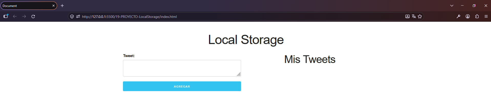

# 💾 Almacenar Textos en LocalStorage

Aplicación web interactiva desarrollada como parte del curso **JavaScript Moderno: Guía Definitiva Construye +10 Proyectos**.

El proyecto permite almacenar, consultar y eliminar textos utilizando la API **LocalStorage del navegador**, demostrando cómo mantener información disponible incluso después de cerrar o recargar la página.

## 🚀 Demo

[Ver proyecto en GitHub Pages](https://cristhianychr.github.io/localstorage-textos-js/)

## 📸 Vista previa



## 🛠️ Tecnologías utilizadas

- HTML5
- Tailwind CSS
- JavaScript
- Web Storage API
- LocalStorage
- DOM
- Git
- GitHub Pages

## ✨ Funcionalidades

- Agregar textos.
- Almacenar información en LocalStorage.
- Recuperar información almacenada.
- Mostrar los textos guardados dinámicamente.
- Eliminar textos.
- Mantener los datos almacenados después de recargar la página.

## 🎯 Conceptos de JavaScript aplicados

- Manipulación del DOM.
- Event Listeners.
- Funciones.
- Arrays.
- Objetos.
- JSON.
- `localStorage.setItem()`.
- `localStorage.getItem()`.
- `localStorage.removeItem()`.
- Persistencia de información en el navegador.
- Manipulación dinámica del HTML.

## 📂 Estructura del proyecto

```text
localstorage-textos-js/
│
├── css/
├── img/
│   └── preview.png
├── js/
├── index.html
├── .gitignore
└── README.md
```

## 🚀 Instalación

Clona el repositorio:

```bash
git clone https://github.com/cristhianychr/localstorage-textos-js.git
```

Ingresa al proyecto:

```bash
cd localstorage-textos-js
```

Abre `index.html` en tu navegador.

## 🎓 Curso

Proyecto desarrollado durante el curso:

**JavaScript Moderno: Guía Definitiva Construye +10 Proyectos**

## 👨‍💻 Autor

**Cristhian Chanamé**

Estudiante de Ingeniería de Software.